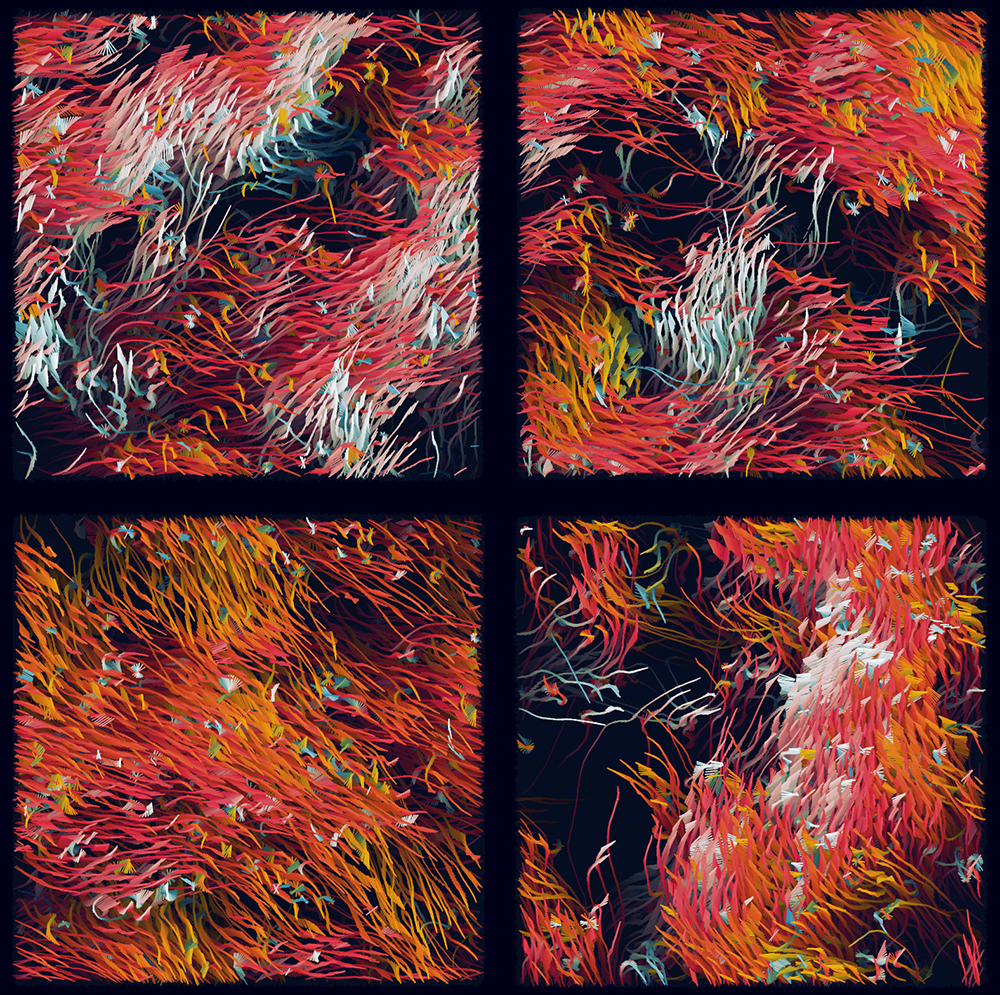
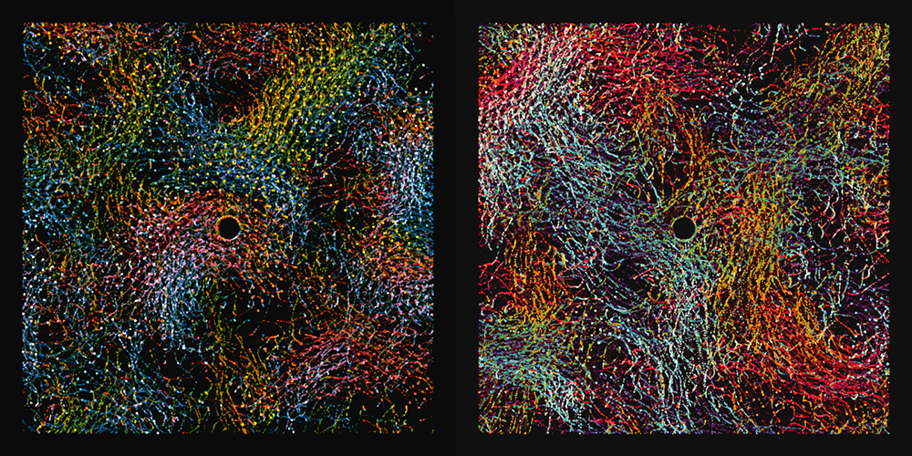

# Flockworks

**A Generative art inspired physical system**, used to render interactive paintings with flocking active matter. More works at [DecodingKunst](https://www.instagram.com/decodingkunst/).

This [Processing](https://processing.org/) code solves a system of "self-propelling" active disks, of varying sizes and velocities, with alignment interactions and some noise. A few different rendering techniques are available for visualizations. The alignment interactions routine is a modification of the method given in: [Martín-Gómez *et al.*](https://arxiv.org/pdf/1801.01002.pdf), *``Collective motion of active Brownian particles with polar alignment"*, Soft matter **14(14)**, pp.2610-2618 (2018).

**NOTE:** This code can be run locally in the Processing IDE, or online at [OpenProcessing](https://openprocessing.org/sketch/2037595).

## How to interact with the code:

- Moving the mouse cursor changes the "alignment interaction neighbourhood" of each particle, visualized as a white circle around one of the particles.
- Making this circle smaller leads to a disordered, isotropic state
- Making it larger leads to localized order, and eventually to global flocking
- Mouse click freezes the motion of the particles, while keeping on their reorientation dynamics (this can be used to demonstrate the effect of orientation alone on flocking)
- In the draw function, the rendering can be changed to one of several options
- Right click will save a frame
- Appropriate lines can be uncommented to save frames for a movie as well

## Paintings
Upon taking enough artistic liberty and deviating from the underlying physics, I arrived at these interesting junctions.

### Floating Weeds


### Fragments


## Some tips for making artworks:

- **Opacity** is key to making trails. Change the "45" in the line `fill(bgcol, 45);` in the range 0-255 for endless-no trails.

- **Colours** can be changed in `color [] cols = {#E63946, #F0A202, #457B9D, #F1FAEE};`, you can find your own nice colours at [Coolors](https://coolors.co/).

- **Layer** multiple renderings for more textured paintings.

- **Variations** will lead to new directions. For instance, explore changing the renderings through
```
for (int i=0; i<N; ++i) {
    // p[i].show();           //-- Simple rendering with spheres
    // p[i].showPaint();      //-- Another nice rendering I used for some paintings
    // p[i].showFlutter();    //-- Shows the active agents as fluttering spheres
    p[i].showLine();       //-- Shows only the diametric line along polar angle   
    // p[i].showLinePaint();
  }
```
and modify the functions in the "functions.pde" file. 

